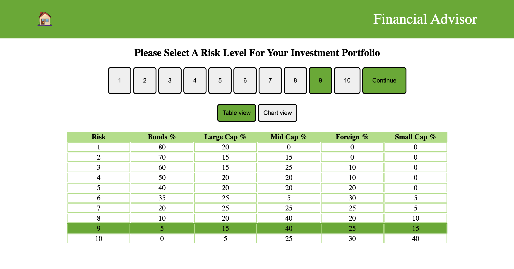

# Financial Advisor

This is a small project which focus on some key features inspired on [Financial Advisor](http://financial-advisor-beta.surge.sh/#/home)
platform. It was build with React (react-router@6, react-redux) and Vite.

## Table of contents

- [Overview](#overview)
  - [Screenshots](#screenshots)
  - [Links](#links)
  - [Built with](#built-with)
  - [Installation](#installation)
  - [User experience](#user-experience)

## Overview
A financial advisor normally asks a few questions to a new customer so as to understand their risk profile, and derives a ‘risk tolerance score’ (or risk preference) for the customer. The financial advisor has a few pre-defined portfolios which allocate a client’s money in certain proportions across multiple investment categories to balance risk. 

### Screenshots
Visiting the home page


Visiting the home page with chart view


Visiting the portfolio calculator


### Links

- Live Site URL deployed with github pages: [Financial advisor deployed]()

### Built with

- ReactJS
- Dependencies: vite, react-router-dom, react-redux

### Installation

To work with the project, you need to have Nodejs (use npm or yarn if like) and GitBash for cloning project. Next, we clone the project directly with the bash (terminal).
```bat
git clone https://github.com/marcosr-okt/finAdvisor

cd finAdvisor
npm install
npm run dev
```
Once all dependencies are installed, go the url displayed on the terminal like the image below (htpp://localhost:3000)


### User experience

Video tutorial for installing the advisor 
[](https://youtu.be/WaGARp-9SSU)
[Video tutorial of features](https://youtu.be/ZHBO5FjY5GQ)
